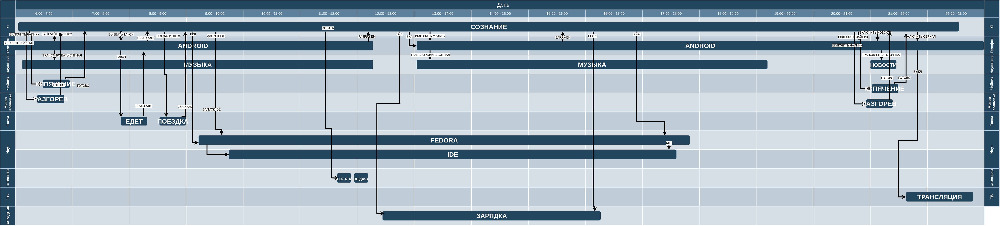

# Диаграмма процессов дня

Добро пожаловать в наш проект! Ниже представлено изображение, которое иллюстрирует мой день:

https://raw.githubusercontent.com/OkinawaNet/process_diagram/refs/heads/main/docs/day.png

## Описание

Диаграмма процессов рабочего дня. Есть некоторые упрощения, чтобы не превращалось в бесконечное дерево процессов. 

Была мысль сделать реализацию через процесс - существование сущности. Потому-что в конечном итоге это тоже можно рассмотреть как процесс. как существование атомов в определенной конфигурации, как работу сил, их связывающих. Но от этого вполне можно абстрагироваться.
